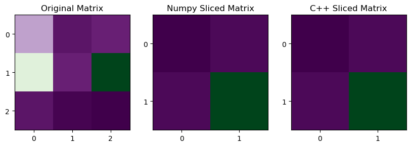

# Task 4 — 2D Matrix Slicing

## Introduction

In this task, I implemented 2D matrix slicing using NumPy and C++. Both programs ask the user for the number of rows and columns and the content of the matrix. I also added slicing parameters for the start and end rows and columns. This makes the programs more flexible.

## NumPy Implementation

The NumPy version uses NumPy's built-in slicing technique. The user enters the slicing parameters, and NumPy selects the required rows and columns.

I also save the original matrix and the sliced matrix to text files. These files are used later for the graphical comparison. I considered adding checks to make sure the slicing indexes are not bigger than the matrix size. However, I decided not to add them because they would make the code more complex.

## C++ Implementation
In the C++ version, I use `std::vector<std::vector<double>>` to store the matrix. I use nested `for` loops to select the required rows and columns.

The C++ program also saves the sliced matrix to a text file. This allows me to compare its result with the NumPy result.
The main difference is that NumPy has a built-in slicing technique, while my C++ version uses loops to access the selected elements.

## Graphical Comparison
I created the graphical comparison in a separate Python program using Matplotlib. First, the NumPy and C++ programs save their results to text files. Then, the graphical program reads these files.
The program displays three matrices side by side: the original matrix, the NumPy result, and the C++ result. I used `imshow()` to display the matrices and added row and column indexes to make the slicing easier to see.



## Experiment and Results
I tested both programs with this matrix:

```text
23   4   6
45   6   78
4    1   0
```

The slicing parameters were:

```text
Start row: 0
End row: 2
Start column: 1
End column: 3
```

The result was:

```text
4   6
6   78
```
Both NumPy and C++ produced the same result. The graphical image also shows that both sliced matrices have the same shape and values.

## Critical Analysis

The NumPy implementation is shorter because NumPy has built-in slicing. In my C++ implementation, I need nested loops to access the selected elements. Both programs use the same start and end parameters. The start index is included and the end index is excluded. The experiment showed that both implementations give the same result.

## ChatGPT Implementation

After completing my own implementation, I asked ChatGPT to implement the same task.

### Prompt

> Implement 2D matrix slicing using NumPy and C++. Use the same matrix and slicing operation in both implementations. Show the results of both solutions and include a graphical comparison to verify that they produce the same result.

### ChatGPT Result

The following is the implementation generated by ChatGPT:

#### Python — NumPy

```python
import numpy as np

matrix = np.array([
    [1,  2,  3,  4,  5],
    [6,  7,  8,  9, 10],
    [11, 12, 13, 14, 15],
    [16, 17, 18, 19, 20],
    [21, 22, 23, 24, 25]
])

result = matrix[1:4, 1:4]

print("Original matrix:")
print(matrix)

print("\nSliced matrix:")
print(result)
```

#### C++ — Matrix Slicing

```cpp
#include <iostream>
#include <vector>

using Matrix = std::vector<std::vector<int>>;

Matrix slice(
    const Matrix& matrix,
    int row_start,
    int row_end,
    int col_start,
    int col_end
) {
    Matrix result;

    for (int i = row_start; i < row_end; i++) {

        std::vector<int> row;

        for (int j = col_start; j < col_end; j++) {
            row.push_back(matrix[i][j]);
        }

        result.push_back(row);
    }

    return result;
}

void print_matrix(const Matrix& matrix) {

    for (const auto& row : matrix) {

        for (int value : row) {
            std::cout << value << "\t";
        }

        std::cout << "\n";
    }
}

int main() {

    Matrix matrix = {
        {1,  2,  3,  4,  5},
        {6,  7,  8,  9, 10},
        {11, 12, 13, 14, 15},
        {16, 17, 18, 19, 20},
        {21, 22, 23, 24, 25}
    };

    std::cout << "Original matrix:\n";
    print_matrix(matrix);

    Matrix result = slice(
        matrix,
        1, 4,
        1, 4
    );

    std::cout << "\nSliced matrix:\n";
    print_matrix(result);

    return 0;
}
```


